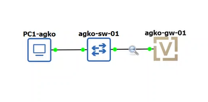
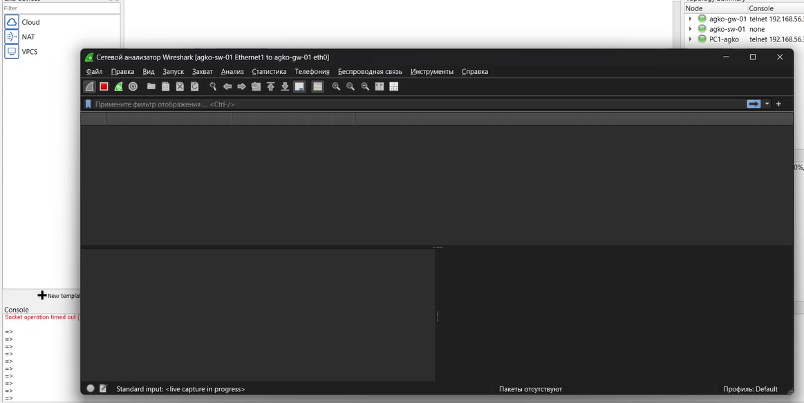
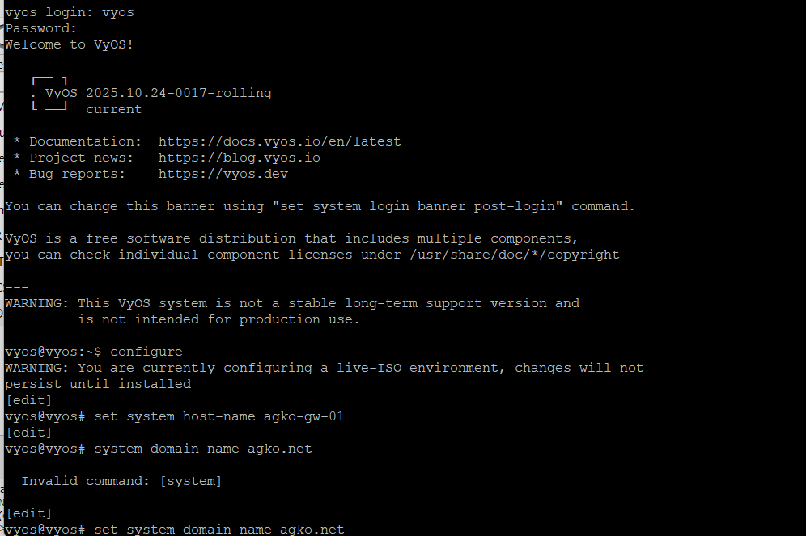
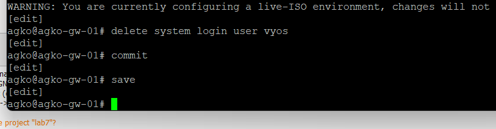
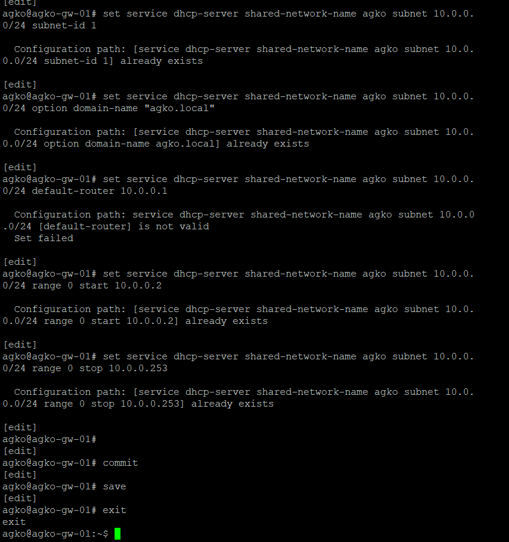
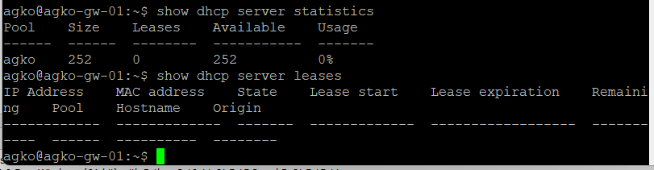
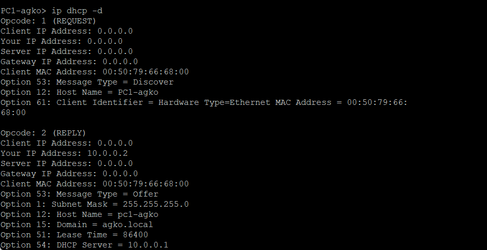
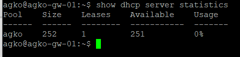
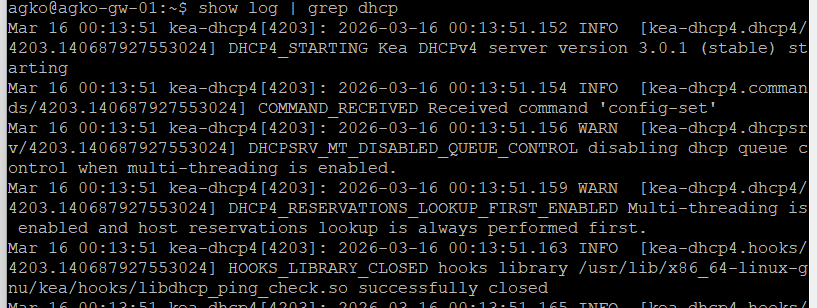

---
## Author
author:
  name: Ко Антон Геннадьевич
  degrees: DSc
  orcid: 0000-0002-0877-7063
  email: antonkosakh@gmail.com
  affiliation:
    - name: Российский университет дружбы народов
      country: Российская Федерация
      postal-code: 117198
      city: Москва
      address: ул. Миклухо-Маклая, д. 6
## Title
title: Лабораторная работа №7
subtitle: Презентация
license: CC BY
date: today
date-format: "YYYY-MM-DD" # Example: 2026-03-08
---

# Информация

## Докладчик

:::::::::::::: {.columns align=center}
::: {.column width="70%"}

  * Ко Антон Геннадьевич
  * студент
  * Российский университет дружбы народов им. П. Лумумбы
  * [1132221551@rudn.ru](mailto:1132221551@rudn.ru)
  * <https://SenDerMen04.github.io/ru/>

:::
::: {.column width="30%"}

:::
::::::::::::::

# Цель работы

Получение навыков настройки службы DHCP на сетевом оборудовании для распределения адресов IPv4 и IPv6.

# Выполнение работы

Соберем топологию сети для первой части задания (IPv4). Она состоит из виртуального ПК (VPCS), коммутатора и маршрутизатора VyOS. (рис. [#fig:002]).

{#fig:002}

Перед началом настройки запустим захват трафика (Wireshark) на соединении между коммутатором и маршрутизатором, чтобы впоследствии проанализировать процесс обмена пакетами DHCP. (рис. [#fig:003]).

{#fig:003}

Зайдем в консоль маршрутизатора VyOS. Выполним базовую настройку системы: зададим имя хоста agko-gw-01, доменное имя и создадим пользователя agko. (рис. [#fig:004]).

{#fig:004}

В целях безопасности удалим стандартного пользователя vyos и сохраним конфигурацию. (рис. [#fig:005]).

{#fig:005}

Приступим к настройке интерфейсов и DHCP-сервера. Назначим интерфейсу eth0 адрес 10.0.0.1/24. Затем настроим службу DHCP-сервера: создадим разделяемую сеть (shared-network) с именем agko, определим подсеть 10.0.0.0/24, шлюз по умолчанию, DNS-сервер и зададим диапазон выдаваемых адресов с 10.0.0.2 по 10.0.0.253. (рис. [#fig:006]).

{#fig:006}

Проверим текущую статистику DHCP-сервера командой show dhcp server statistics. Мы видим, что размер пула составляет 252 адреса, и на данный момент нет выданных адресов (Leases: 0). (рис. [#fig:007]).

{#fig:007}

Перейдем к клиенту VPCS (PC1) и запросим получение адреса по DHCP с помощью команды ip dhcp -d. Флаг -d позволяет увидеть подробный вывод процесса DORA (Discover, Offer, Request, Acknowledge). Клиент успешно получил адрес 10.0.0.2. (рис. [#fig:008]).

{#fig:008}

Вернемся на маршрутизатор и снова проверим статистику и список арендованных адресов. Теперь мы видим одну активную аренду для IP-адреса 10.0.0.2, привязанную к MAC-адресу нашего PC1. (рис. [#fig:009]).

{#fig:009}

Посмотрим системные логи маршрутизатора, отфильтровав их по строке dhcp. Это позволяет увидеть сообщения службы DHCP о запуске и работе. (рис. [#fig:010]).

{#fig:010}

Далее у меня просто не хотел нормально запускаться GNS3 VM из-за VyOS. Дальше выполнять эту лабораторную работу не предоставилось возомжным.
