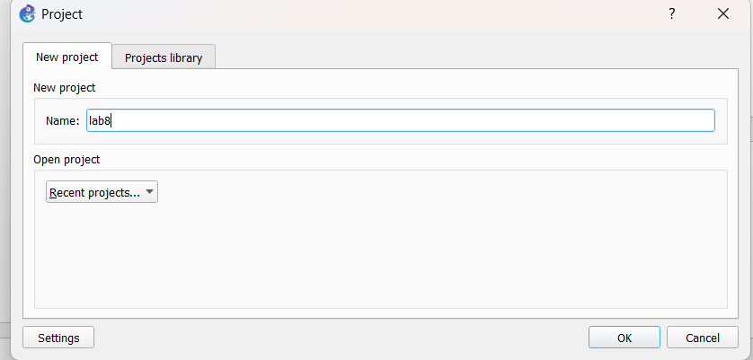
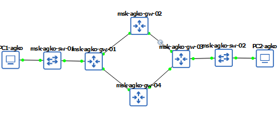
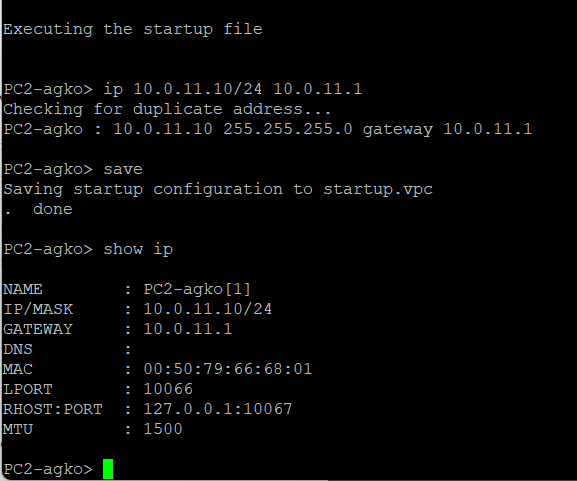
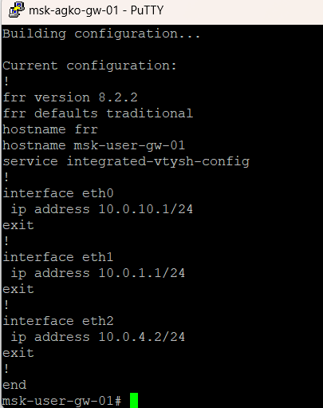
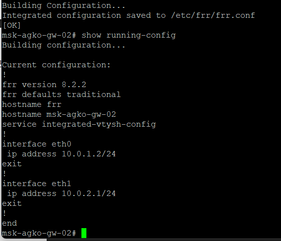
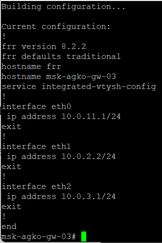
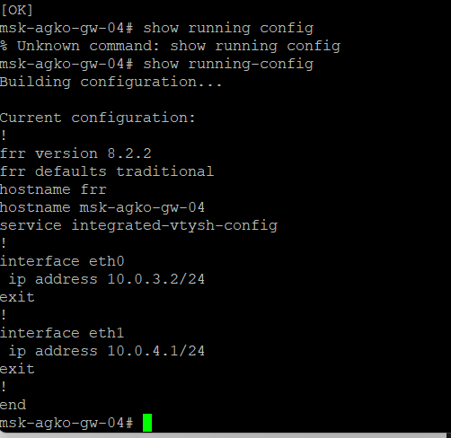
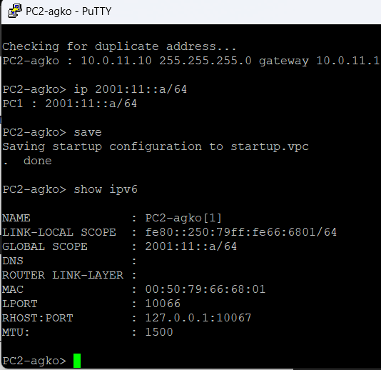
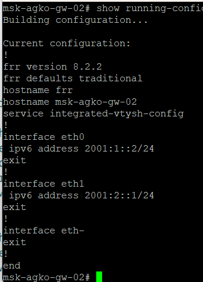

---
## Author
author:
  name: Ко Антон Геннадьевич
  degrees: DSc
  orcid: 0000-0002-0877-7063
  email: 1132221551@rudn.ru
  affiliation:
    - name: Российский университет дружбы народов
      country: Российская Федерация
      postal-code: 117198
      city: Москва
      address: ул. Миклухо-Маклая, д. 6
## Title
title: Лабораторная работа 8
subtitle: Адресация IPv4 и IPv6. Настройка маршрутизации
license: CC BY
date: today
date-format: "2025-12-20" # Example: 2025-09-06
---

# Информация

## Докладчик

:::::::::::::: {.columns align=center}
::: {.column width="70%"}

  * Ко Антон Геннадьевич
  * д.ф.-м.н., студент
  * Российский университет дружбы народов им. П. Лумумбы
  * [1132221551@rudn.ru](mailto:1132221551@rudn.ru)
  * <https://SenDerMen04.github.io/ru/>

:::
::: {.column width="30%"}

:::
::::::::::::::

## Цель работы

Изучение принципов маршрутизации в IPv4- и IPv6-сетях и принципов настройки сетевого оборудования

## 

{#fig:001}

## 

{#fig:002}

## 

{#fig:003}

## 

{#fig:004}

## 

{#fig:005}

## 

{#fig:006}

## 

{#fig:007}

## 

{#fig:008}

## 

{#fig:009}

## 

{#fig:010}

## 

{#fig:011}

## 

{#fig:012}