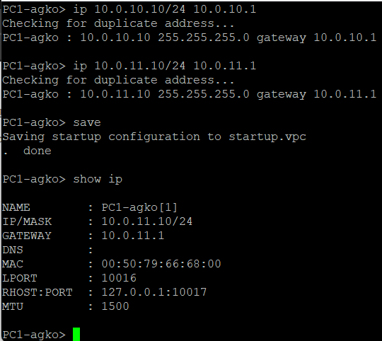
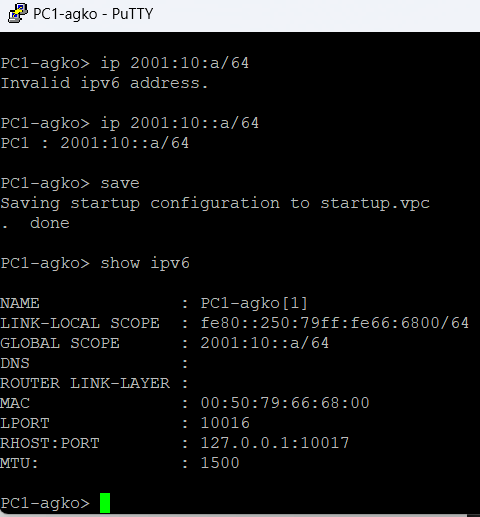
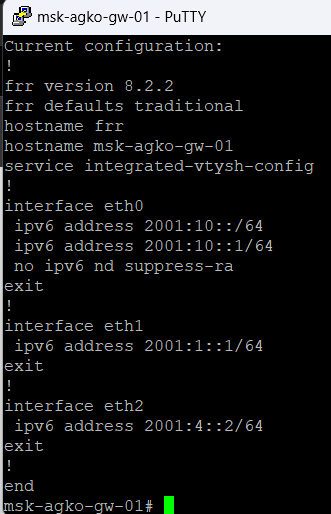

---
## Front matter
title: " Сетевые технологи"
subtitle: "Лабораторная работа № 8."
author: "Ко Антон Геннадьевич"

## Generic otions
lang: ru-RU
toc-title: "Содержание"

## Bibliography
# bibliography: bib/cite.bib
# csl: pandoc/csl/gost-r-7-0-5-2008-numeric.csl

## Pdf output format
toc: true # Table of contents
toc-depth: 2
lof: true # List of figures
lot: false # List of tables
fontsize: 12pt
linestretch: 1.5
papersize: a4
documentclass: scrreprt
## I18n polyglossia
polyglossia-lang:
  name: russian
  options:
    - spelling=modern
    - babelshorthands=true
polyglossia-otherlangs:
  name: english
## I18n babel
babel-lang: russian
babel-otherlangs: english
## Fonts
mainfont: Latin Modern Roman
romanfont: Latin Modern Sans
sansfont: Latin Modern Roman
monofont: Latin Modern Sans
mainfontoptions: Ligatures=TeX
romanfontoptions: Ligatures=TeX
sansfontoptions: Ligatures=TeX,Scale=MatchLowercase
monofontoptions: Scale=MatchLowercase,Scale=0.9
## Biblatex
biblatex: true
biblio-style: "gost-numeric"
biblatexoptions:
  - parentracker=true
  - backend=biber
  - hyperref=auto
  - language=auto
  - autolang=other*
  - citestyle=gost-numeric
## Pandoc-crossref LaTeX customization
figureTitle: "Рис."
tableTitle: "Таблица"
listingTitle: "Листинг"
lofTitle: "Список иллюстраций"
lotTitle: "Список таблиц"
lolTitle: "Листинги"
## Misc options
indent: true
header-includes:
  - \usepackage{indentfirst}
  - \usepackage{float} # keep figures where there are in the text
  - \floatplacement{figure}{H} # keep figures where there are in the text
---

# Цель работы

Изучение принципов маршрутизации в IPv4- и IPv6-сетях и принципов настройки сетевого оборудования

# Выполнение работы

Создадим новый проект в GNS3 с именем «lab8» (рис. [#fig:001]).

{#fig:001}

Соберём топологию сети согласно заданию, разместив коммутаторы, маршрутизаторы FRR и оконечные устройства (рис. [#fig:002]).

{#fig:002}

Настроим IP-адрес и шлюз по умолчанию на PC1 (рис. [#fig:003]).

{#fig:003}

Настроим IP-адрес и шлюз по умолчанию на PC2 (рис. [#fig:004]).

{#fig:004}

На маршрутизаторе gw-01 зададим имя хоста и настроим IPv4-адреса на интерфейсах eth0, eth1 и eth2 (рис. [#fig:005]).

{#fig:005}

На маршрутизаторе gw-02 зададим имя хоста и настроим IPv4-адреса на интерфейсах eth0 и eth1 (рис. [#fig:006]).

{#fig:006}

На маршрутизаторе gw-03 зададим имя хоста и настроим IPv4-адреса на интерфейсах eth0, eth1 и eth2 (рис. [#fig:007]).

{#fig:007}

На маршрутизаторе gw-04 зададим имя хоста и настроим IPv4-адреса на интерфейсах eth0 и eth1 (рис. [#fig:008]).

{#fig:008}

Настроим IPv6-адрес на PC1 (рис. [#fig:009]).

{#fig:009}

Настроим IPv6-адрес на PC2 (рис. [#fig:010]).

{#fig:010}

На маршрутизаторе gw-01 включим маршрутизацию IPv6 (forwarding) и настроим IPv6-адреса на интерфейсах (рис. [#fig:011]).

{#fig:011}

На маршрутизаторе gw-02 включим маршрутизацию IPv6 и настроим адреса на интерфейсах (рис. [#fig:012]).

{#fig:012}

Дальше всё есть в видео. Как можно понять у меня не работает RIP, OSPF протоколы т.к. они ничего не видят. А VyOS снова вылетает, как и в 7 лаб. работе. К сожалению, продолжать работу не предоставляется возможным.
